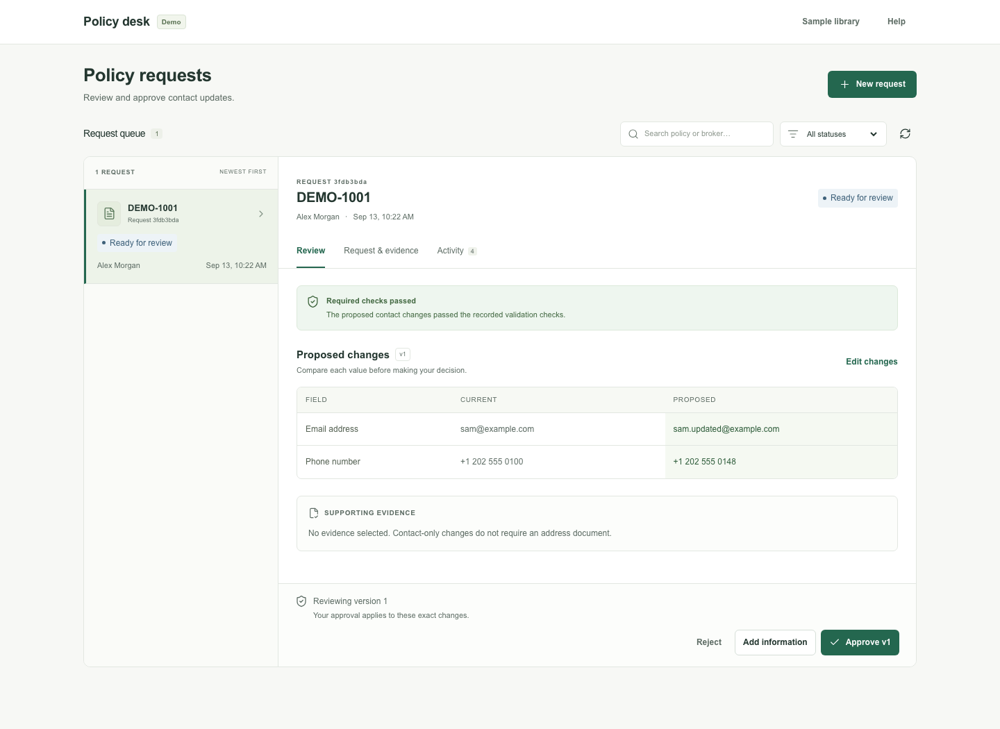

# Insurance Policy Update Automation Agent

A synthetic-data demo of broker requests, model-selected tools, and human-approved
contact updates. Read the [plan](_docs/plan.md), [delivery checklist](_docs/process.md),
[test coverage](_docs/testing-guidelines.md), and
[design baseline](_docs/design-system.md).

## What works

The minimal Next.js dashboard supports isolated guest workspaces, sample requests,
pasted English requests, PDF uploads, a request queue, evidence findings, before/after
comparison, proposal edits, approval/rejection, corrected evidence, retry, unsent
drafts, and activity history.

With a Gemini key configured, the backend extracts structured changes from free text and
runs a bounded LangGraph loop. The model selects from eight typed tools, observes their
results, and pauses for information or human approval. Every tool reuses backend
authorization, evidence, versioning, and execution controls. Without a key, structured
samples run through the rule-based path; unstructured requests need reviewer-supplied
changes. Set `AGENT_LOOP=off` for extraction without tool selection.

Only mailing address, email, and phone changes are allowed. Address changes need
matching evidence. Missing, uncertain, conflicting, or unreadable required evidence
blocks the whole request. Human approval binds to the exact proposal version; editing or
adding information invalidates it. The agent cannot approve itself.

The worker processes durable jobs outside browser requests. `/process`, `/resume`, and
`/retry` return 202 when queued. Leases, checkpoints, persisted errors and manual
retries support recovery. An approved update, its unique execution receipt, audit
outcome, and completed state commit together. Repeating execution returns the original
receipt. Approval alone does not apply an update.

PDF text layers are inspected for labeled `Account holder:` and `Service address:` lines
with page references. Attachments live in private database rows, scoped to one workspace
and case. Images can be stored by the API but remain uncertain; image/OCR inspection is
deferred. No document-authenticity claim is made.

Three local Gemini/dashboard scenarios were reported passing on 2026-09-13:
valid approval/application, missing evidence corrected on the same case, and
conflicting evidence corrected on the same case. Case IDs and recordings were
not retained. Automated tests use fakes; these manual results do not establish
hosted acceptance or measured accuracy.



## Run locally

Requirements: Python 3.12+, uv, Node.js 22+, and npm.

```sh
uv sync --locked
cp .env.example .env
uv run uvicorn policy_update.api:create_app --factory --reload
```

Add `GEMINI_API_KEY` to `.env` to enable Gemini. Keep the key server-side; never use a
`NEXT_PUBLIC_*` key or commit `.env`. `GEMINI_MODEL` selects a model your project can
access; the source default is `gemini-3.8-flash`, and prior live checks used
`gemini-3.5-flash-lite`. Availability and quota depend on your project. The environment
wins over `.env`; `POLICY_UPDATE_ENV_FILE` changes the file path.

A new SQLite database initializes automatically. **An existing unversioned demo needs an
explicit migration before restarting this release.** Stop API/workers, back up the file,
then run:

```sh
env DATABASE_URL=sqlite:///./policy_demo.db uv run python -m policy_update.migrate
```

This preserves records. Do not delete your database to upgrade it. See the
[migration and maintenance runbook](_docs/deployment.md).

The default `WORKER_MODE=embedded` runs a worker thread in the API. For separate
processes, start these in separate terminals from the repository root:

```sh
env WORKER_MODE=external uv run uvicorn policy_update.api:create_app --factory
uv run python -m policy_update.worker
```

Both use the same `DATABASE_URL`. `/health` reports model configuration and worker mode.
Use `JOB_LEASE_SECONDS=180` for hosted operation to allow time for model retries and
database locking. The database queue persists across worker restarts.

### Dashboard

In another terminal:

```sh
cd frontend
npm ci
npm run dev -- --port 3002
```

Open http://127.0.0.1:3002. Choose **Open demo workspace**, then **New request**. Use a
sample or paste a request. Review, approve the displayed version, and then choose
**Apply approved update**. Corrected PDFs attach through **Add information** on the same
case. Resume processing when offered. To change proposed values, use **Edit changes**;
reply text currently reuses the previous proposal's changes.

`POLICY_API_URL` defaults to `http://127.0.0.1:8000` and is server-only. Guest bearer
tokens stay in an HttpOnly, SameSite=Strict cookie. HTTPS deployments set
`COOKIE_SECURE=true`. Browser guests are separate from Swagger/CLI guests. Guests expire
after seven days; their records are deleted by offline maintenance.

The API explorer is http://127.0.0.1:8000/docs. `/` on port 8000 returning 404 is
normal; the product dashboard runs on the frontend port.

## Processing and troubleshooting

A 202 response means queued, and repeated GET 200 responses are normal polling. Inspect
the dashboard's job status and error; `processing finished` does not mean that a policy
update was applied. The case may be waiting for information or approval.

Model errors expose only a sanitized HTTP status/provider category, for example 429
RESOURCE_EXHAUSTED or 503 UNAVAILABLE. Check quota in AI Studio and retry the existing
case when available. Authentication/configuration failures need a corrected key/model,
followed by API/worker restart. Older generic errors cannot be diagnosed retroactively.
One case can make multiple model calls and exhaust a free quota.

Public-demo limits are persisted in the database: workspace capacity, cases, attachment
bytes/count, proposal versions, and queued runs per workspace/day. An exceeded limit
returns 429. The [runbook](_docs/deployment.md) lists defaults, cleanup procedure, and
the distinction between job budgets and model spending.

## Checks

```sh
uv run ruff check .
uv run ruff format --check .
uv run pytest -q --tb=short
```

Tests never read `.env` or call Gemini. They use explicit `None` or scripted models,
real storage, and a worker driven synchronously by test helpers. Set `TEST_DATABASE_URL`
only for a dedicated PostgreSQL test database. Migration tests create and remove
isolated schemas there; other tests leave synthetic guests.

Frontend checks (inside `frontend`):

```sh
npm ci
npx playwright install chromium firefox webkit
npm run format:check
npm run typecheck
npm run build
npm test
```

The suite starts isolated services on ports 8001/3001 with temporary SQLite and a
scripted retry fake. It does not use the running model-enabled API. Axe checks do not
replace a manual screen-reader audit. Playwright WebKit is not the Safari application.
Details and actual run results are in the testing guide.

`uv run python scripts/demo.py` is a separate smoke companion against a running
synthetic API. It creates records and performs simulated approvals/updates; with Gemini
configured, it makes live model calls. `scripts/evaluate_model.py` evaluates seven
labeled synthetic/adversarial requests. Run these only deliberately, outside the test
suite. The historical 7/7 result is not a broad accuracy/security claim.

## Deployment

Dockerfiles, `compose.yaml`, and `render.yaml` are prepared for frontend, private API,
separate worker, and PostgreSQL. The local Compose frontend uses port 3003. Set
`GEMINI_API_KEY=` and use `--env-file /dev/null` for a model-free local container check.
The Render configuration selects paid resources and must be reviewed before
provisioning. The project has not been deployed to a host yet.

Follow [_docs/deployment.md](_docs/deployment.md) for migration, private storage, secure
cookies, cleanup, release order, and hosted recovery checks.
[_docs/demo-recording.md](_docs/demo-recording.md) contains the three demo recording
scripts. Hosting acceptance and videos remain pending; image inspection, case chat, and
real inbox integration remain deferred.

## Boundaries

- Tokens scope every guest operation. Broker identity is simulated, not inferred from
  email text. Unauthorized brokers cannot inspect or update policy values.
- Email and PDF contents are untrusted evidence, never permission to approve or bypass
  validation. The model sees only typed, case-scoped processing tools.
- Replies/edits create new proposal versions. Stale approvals and executions fail;
  evidence, authorization, and policy revision are checked again at execution.
- Attachments require authenticated, same-case access. There are no public files, real
  insurance records, or outgoing emails. Follow-ups and confirmations stay drafts.
- Operational logs omit request bodies, credentials and document bytes. The stored case
  audit intentionally contains synthetic proposed/applied values and tool outcomes.
