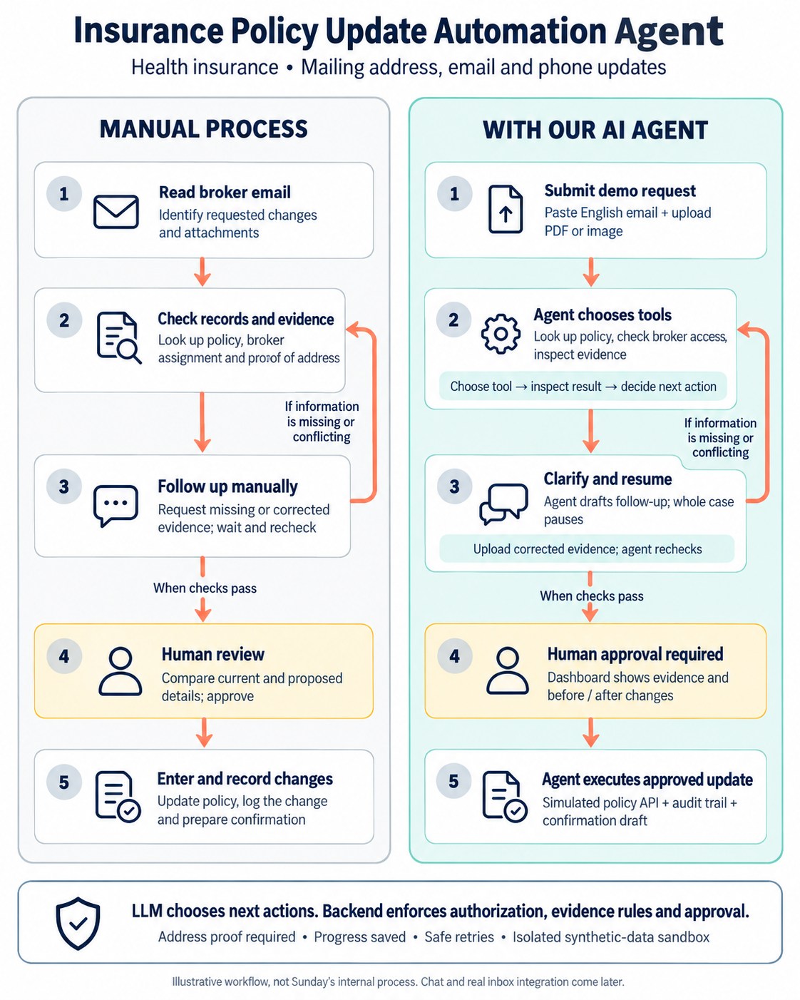

# Insurance Policy Update Automation Agent

## Project description

A bounded AI agent that selects tools to process broker requests, validate supporting documents, and update health insurance policyholder contact details after human approval. The demo includes a review dashboard, audit history, persistent progress, and safe retries using synthetic data.

This document records the agreed scope, not completed functionality. The business rules and manual process are illustrative; they do not represent Sunday’s internal procedures or verified insurer requirements.

## Objective and delivery priority

Demonstrate the skills required of a Forward-Deployed AI Engineer: translate a business process into a useful agent, integrate APIs and storage, support non-technical reviewers, and enforce human approval.

- Target overall effort: approximately 35–50 focused hours, favoring the lower bound.
- Immediate priority: complete and deploy one working end-to-end core demo for the job application.
- Build the core workflow first, then add case chat. Real inbox integration follows later.
- A deployed demo demonstrates production-oriented controls; it does not establish readiness to operate on real insurance records.

## Business problem and manual baseline

Staff read broker emails and attachments, identify requested changes, locate the policy, check the broker’s servicing assignment, compare evidence, chase missing information, obtain approval, enter updates, and record the outcome.

The agent performs the information gathering and proposes next actions. Reviewers retain approval authority, and backend rules control what can be executed. No time-saving or accuracy claims should be made until measured.

The diagram summarizes the process. Follow-up is conditional: a complete, valid request can proceed directly from checks to human approval.

## Agreed core scope

### Product and permitted changes

- Health insurance policies.
- Update the policyholder’s mailing address, email address, and/or phone number.
- A single request may change any combination of these fields.
- Treat the request as one unit: unresolved required information blocks all its changes.
- Exclude identity changes, insured property addresses, coverage, premiums, renewals, cancellations, medical information, claims decisions, and payments.

### Intake and guest sandbox

- English-only pasted email text and uploaded PDF/image attachments.
- Require an explicit policy number; do not infer a policy by name or email.
- Missing or unknown policy numbers trigger a clarification draft and pause.
- Give each guest an isolated workspace with synthetic policies, broker assignments, example emails, and fictional proof-of-address documents.
- Associate each request with a seeded simulated broker identity. Check that broker’s assignment to the policy in backend code.
- An email’s claimed sender is untrusted input, not proof of identity. Denied broker access blocks processing and policy changes.
- Keep intake separate from case processing so a future inbox adapter can submit the same case structure.

### Supporting evidence and follow-up

- Address changes require a fictional proof-of-address document; contact-only changes do not require an attachment.
- Extract the document’s name and address and compare them with the policyholder record and requested address.
- Harmless formatting differences are acceptable; missing, unreadable, conflicting, or uncertain evidence requires clarification and corrected evidence.
- A reviewer cannot waive an evidence conflict. Corrected evidence is required before approval.
- The agent drafts a follow-up for human review and pauses the entire request.
- Simulate the broker’s reply by adding reply text and/or uploading corrected evidence to the same case, then resume it.
- Follow-ups and confirmations are drafts only in the initial release. No real email is sent.
- Document validation checks content consistency; it does not establish document authenticity.

### Review and execution

- Dashboard: case list, status, original request, attachments, source references, validation findings, and current versus proposed values.
- Reviewers can inspect, edit, approve, or reject a proposal using dashboard controls.
- Any proposal edit reruns validation and invalidates prior approval.
- Approval is bound to the exact proposed change version. The agent cannot approve its own work.
- After approval, the agent calls a simulated policy administration API that persists the permitted changes in the demo database.
- Record the result and generate a confirmation draft.
- Show an action timeline with tool calls, outcomes, and concise decision summaries. Do not expose hidden model reasoning.

## What makes this an agent

The LLM receives a goal, case state, and a bounded set of tools. It chooses a tool, observes the result, and decides the next action until the case is complete, waiting for information, awaiting approval, or stopped for review.

Suggested goal:

> Resolve this broker’s policy update request. Gather sufficient evidence, prepare valid changes for human approval, and complete the approved update using only permitted tools.

LangGraph supplies persistence, interruption, and execution boundaries. It must not reduce the core to a fixed sequence of extraction prompts presented as an agent. Mandatory controls still apply regardless of the tool order selected by the LLM.

### Permitted tool responsibilities

- `get_policy`: retrieve an accessible policy in the current sandbox; enforce access before revealing policy details.
- `check_broker_assignment`: check the seeded broker-to-policy servicing assignment.
- `inspect_document`: extract relevant fields and retain references to supporting pages or evidence.
- `validate_proposed_changes`: enforce allowed fields, contact formats, required evidence, and consistency checks; treat uncertain evidence as unresolved.
- `draft_follow_up`: prepare a clarification request and place the case in a waiting state.
- `submit_for_approval`: create a versioned proposal only when required checks pass.
- `apply_approved_update`: execute only the exact approved, still-valid proposal through the simulated API, with duplicate protection.
- `draft_confirmation`: summarize the successfully applied changes without sending email.

These are implementation responsibilities, not a requirement for an exact function signature. All tools are scoped to the current case and sandbox. The LLM cannot issue arbitrary database writes or call unrestricted external APIs.

### LLM decisions versus backend controls

The LLM decides which permitted tools are useful, which evidence needs inspection, when to clarify, what to draft, and when to request review.

Backend code enforces sandbox isolation, broker authorization, permitted fields, evidence prerequisites, approval versions, and safe execution. Uploaded documents and email text are evidence, never instructions granting new permissions. Use typed tool inputs/results and a bounded tool-call budget. Stop for review when the limit is reached or ambiguity remains.

## Persistence, auditability, and failure recovery

- Persist case records, proposals, validation outcomes, and LangGraph checkpoints so a restart does not lose progress.
- Support manual retry of temporary processing or API failures. Automatic retry orchestration is deferred.
- Use a stable idempotency key per approved proposal. The simulated update API must return the previous outcome for repeated execution of that operation.
- Save the update and its audit outcome transactionally so a crash cannot silently create an unaudited change.
- Preserve approval validity and recheck relevant policy state before execution; changed underlying data requires fresh validation and approval.
- Record who acted, when, what changed, the proposal version, and the execution result. Avoid copying document contents or sensitive values into general application logs.
- Suggested case statuses: processing, awaiting information, awaiting approval, completed, rejected/blocked, and failed/retryable.

## Technology direction

- Python, FastAPI, and Pydantic for the backend, typed tool contracts, business rules, and simulated policy API.
- LangGraph for the bounded tool-selection loop, durable state, and human approval interrupts.
- Next.js/React for the case dashboard and later chat panel.
- PostgreSQL for policies, assignments, cases, proposals, and audit records.
- Supabase is the proposed managed PostgreSQL, private attachment storage, and guest-session option; provider details remain implementation choices.
- One hosted LLM supporting tool use, structured output, and document/image interpretation; model selection remains open.
- Docker and a simple managed host such as Render; persist processing jobs and execute them outside the lifetime of a browser request.
- pytest and CI for meaningful validation, authorization, approval, isolation, and recovery checks.

No vector database, model training, multi-agent delegation, or separate planning service is needed for this scope.

## Core demo acceptance criteria

1. A guest opens an isolated workspace and can try provided sample inputs.
2. An authorized broker submits a valid address/contact request; the agent selects tools and prepares an evidence-backed proposal.
3. A contact-only request can proceed without a proof-of-address attachment.
4. Missing policy numbers or required evidence produce a clarification draft and pause the entire case.
5. Conflicting evidence blocks approval; adding corrected evidence lets the agent resume and recheck.
6. An unassigned broker cannot inspect or update the policy through agent tools or direct API calls.
7. The reviewer sees before/after values and approves the exact proposed changes.
8. The agent applies the approved update through the mock API, with saved policy values, audit history, and a confirmation draft visible in the dashboard.
9. Unapproved or stale proposals cannot execute, including through a direct API call.
10. A restart preserves a paused case; retrying an approved update does not apply it twice.
11. A guest cannot read or modify another guest’s cases or attachments.
12. Instructions hidden in email/attachments cannot bypass tool permissions or approval requirements.

For the demo video, show a valid case, a missing-evidence case that resumes, and a conflicting-evidence case. Demonstrate an update retry if time allows. Measure results on synthetic cases and label them as such.

## Later phase: case chat

Add chat after the deployed core works end to end. The core is already an agent; chat is another interface to it.

- Explain the selected case, its status, proposed changes, and missing evidence using case records.
- Draft and rewrite follow-ups and confirmations.
- Propose edits, rerun checks, and resume eligible cases through permitted tools.
- Preview chat-triggered edits and require confirmation before saving.
- Confirmed edits rerun validation and invalidate prior approval.
- Approval stays an explicit dashboard control; chat cannot bypass it.

## Later phase: real inbox integration

Replace pasted-email intake with a real inbox adapter while preserving the same processing and review core. Real sender authentication, thread matching, access configuration, and outbound messaging need separate design and testing before use. They are outside the initial demo.
